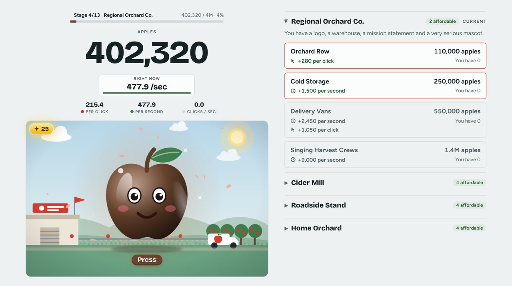
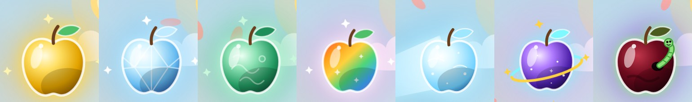
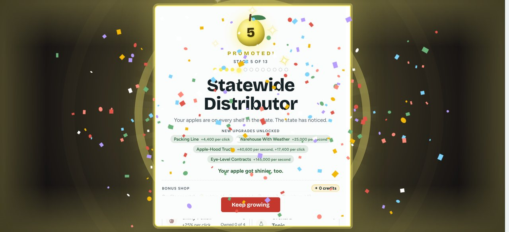
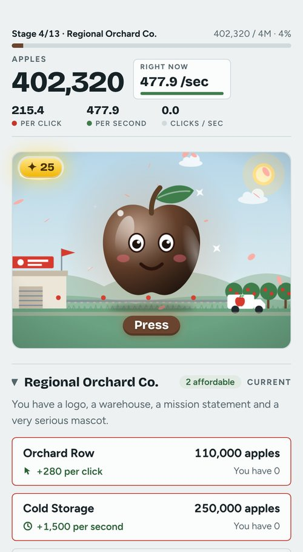
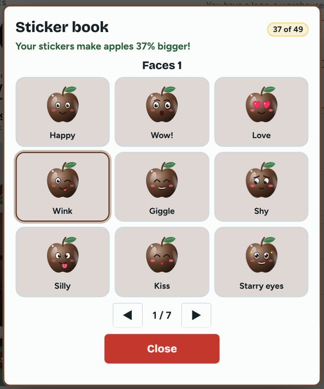
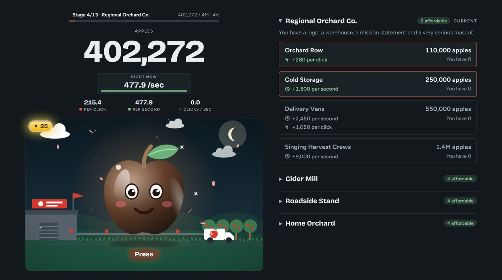

# 🍎 Apple Press

> **BETA: for testers only.** This is a work-in-progress version of the game that friends and family are helping to test. Things will change, and some things may be rough. Your progress is saved in your own browser, and a new update could occasionally change how the game plays.

**▶ Play it here: https://jnfoo.github.io/apple-press/**

Apple Press is a free clicker game for kids in a single web page. Tap a big cartoon apple to pick apples, buy upgrades, and grow a little backyard orchard into something far, far bigger.

- **For children and families.** No ads, no purchases, no accounts.
- **Works offline.** After it loads once, no internet is needed. Open it in any modern browser on a phone, tablet or computer.

## 🎮 How it plays

Each press earns apples. Upgrades add apples per press and per second. Every stage brings a promotion party, a new animated scene, a new apple color and new upgrades. A first adventure ends after six stages; after that, the full 13-stage journey opens up, and the most dedicated players may find there is more to discover.

## ⭐ What's in the game

- **A lively apple:** about 22 moods, eyes that follow your finger, and a spin now and then to show off. 
- **Upgrades that double:** own 10, 25 or 50 of the same upgrade and every copy gets twice as strong.
- **Combos:** press quickly to build a combo and watch the counter heat up from ember red to white-hot.
- **Special apples:** golden, crystal, jade, rainbow, comet, cosmic and a few secret kinds fly across the scene. Catch them for bursts of apples and bonus credits. In the later stages, watch out for the poison apple!
- **Shops and collectibles:** a bonus shop, Extras that open as you play again, hats and costumes, scenery friends (a cat, a dog, a garden gnome, a friendly UFO and more), and a sticker book with 49 stickers to earn.
- **Your own story:** the ending opens a picture storybook of your game.
- **Looks and settings:** light and dark modes, Full, Lite and Calm effects (picked automatically on slower devices), a title screen that dresses up for the seasons and more than 40 holidays, and an unlockable mode for players who go the distance.
- **Safe saving:** progress autosaves in your browser, keeps a backup copy, and can be copied or downloaded to move to another device.
- **A quick tour:** new players get a friendly guided look at the page the first time they play, in short steps with simple words that young children can follow. It can be skipped, and opened again from the How to play button.
- **Built for kids:** big tap targets, no timers or streaks, and nothing to trade.

<table>
<tr>
<td align="center" valign="top"> On a phone</td>
<td align="center" valign="top"> The sticker book: 49 to collect</td>
</tr>
</table>

 Dark mode, with a night scene

## ♿ Accessibility

- **No noise.** There are no sounds or music, so there is no volume to manage. That suits kids with sensory challenges, and parents who have heard enough beeping for one day.
- **Flash-safe celebrations.** The promotion celebrations are checked against flash-safety limits.
- **Hold to press.** Hold the apple down and it keeps pressing for you, which helps tired hands and younger players who find rapid tapping hard. It can be switched off in the footer.
- **Gentler effects.** The Calm effects setting tones down motion, and the game picks a lighter setting by itself on slower devices.

## 💡 Playing tips

- Phones play best held upright. Tablets can be played sideways.
- If the game feels slow on an older device, try the Lite or Calm effects setting.
- Clearing your browser's site data erases your saved progress, so use the save backup first if you want to keep it.

## 🧪 Testing and feedback

Please tell Jawad what you find: anything confusing, anything too hard or too slow, anything that looks or runs badly, and which device and browser you used. If you have a GitHub account you can also open an issue on this page.

## 🆕 What's new

See [changelog.md](changelog.md) for the full list of changes, newest first.

## © Ownership

Copyright © 2026 Jawad Niazi. All rights reserved. A license will be chosen once the game reaches version 1.0. The fonts are used under the SIL Open Font License.
